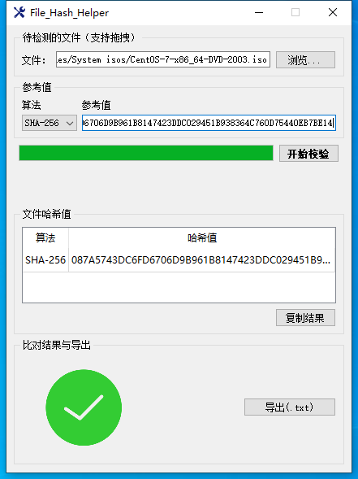

# file_hash_helper 
[toc]
## 软件简介

- 计算文件哈希值
- 复制计算结果
- 与参考值比对显示比对结果
- 导出文件哈希值为txt文件
- 支持MD5, SHA-1, SHA-224, SHA-256, SHA-384, SHA-512共六种常见哈希算法

## 软件截图

- 主界面

- 计算中

- 计算完成

- 比对成功

- 比对失败

- 复制结果

- 导出界面

- 导出中

- 导出成功

- 导出文件

## 尚未完成功能（暂不确定是否加入）

1. “x”-左/右上角关闭-按下后强制结束一切活动

  - 目前按下"x"后可能尚无法完全结束程序
  - 由于没有对close()进行重写
  - 因此使用时尽量避免未计算完成便关闭程序窗口

  

2. 按下“开始校验”按钮后仅冻结会造成线程冲突的控件

	- 目前按下“开始校验”按钮后会冻结整个主窗口
	- 简单地解决了线程间可能出现的数据冲突问题
	- 但同时造成主窗口不能响应不造成影响的其他信号